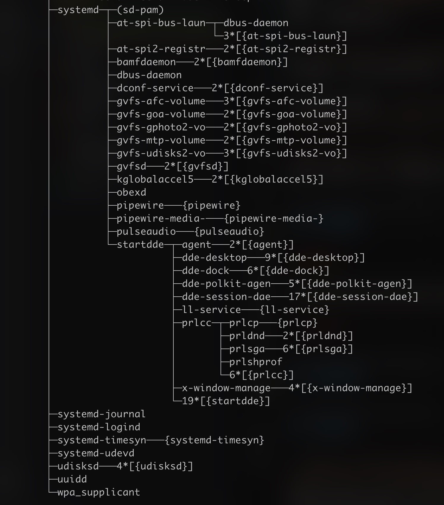

DDE 现在正在做 Wayland 的支持，所以我们需要对目前的桌面环境结构进行调整，
考虑到 GNOME 和 KDE 都已经使用 `systemd` 来管理 session，我认为 deepin 团队也可以考虑这一步了。

## 为什么需要 systemd？

目前 `systemd` 作为事实上胜利的 init 进程，它现在负责的功能已经越来越多了，支持但不限于：`udev`、`sleep/hibernate/suspend`、`dbus`、`services` 等。现在越来越多的程序也开始使用 `systemd` 管理后台服务。

## 不使用 systemd 来管理 session 会有什么问题吗？

存在一个进程逃逸问题，不过这个问题与是否采用 `systemd` 管理 `session` 没有太大关系。

我先来简单介绍一下目前 DDE 的工作模型：

首先，DDE 使用 `LightDM` 作为显示服务器（Display Manager），DDE 提供了 `lightdm-deepin-greeter` 作为登录界面，greeter 可以通过调用 LightDM 的 api 进行 linux-pam 的认证。

当认证通过后，LightDM 会启动一个会话（Session），之后运行的程序都将是以登录的用户身份启动，然后 `systemd --user` 进程会被启动，同时 `dbus-daemon` 也会启动，之后 LightDM 会启动 `startdde。`

此时就开始执行到 DDE `的初始化阶段，startdde` 会启动 `dde-session-daemon` 和 DDE 的核心组件，之后就并行启动 autostart 中的 desktop 文件。

`startdde` 目前的流程本身没有问题，问题出在 `systemd` 接管了 dbus，并且从 `systemd 226` 版本开始，`/etc/pam.d/system-login` 默认配置中的 `pam_systemd` 模块会在用户首次登录的时候, 自动运行一个 `systemd --user` 实例。 只要用户还有会话存在，这个进程就不会退出；用户所有会话退出时，进程将会被销毁。当#随系统自动启动 `systemd` 用户实例启用时, 这个用户实例将在系统启动时加载，并且不会被销毁。

> `systemd --user` 实例是针对每个用户处理的，而不是针对会话。这样做的原理是用户服务处理的大部分资源，像 socket 或状态文件是针对每个用户的（存活于用户的主目录下）而不是会话。这意味着所有的用户服务是独立于会话之外运行的。最终，我们得出结论：基于会话运行的程序可能会导致用户服务中断。`systemd` 处理用户会话的方式是非常生硬的（pretty much in flux）。

那么问题就来了，上面说了，systemd 接管了 dbus 服务，通过 dbus 启动的程序会在 `dbus.service` 下面，成为它的子进程，而 `systemd --user` 在有用户其它登录的会话存在时，并不会停止 `systemd --user`，所以 `dbus.service` 也不会停止。但是 dde 的会话
已经完成注销了，但是通过 dde 启动的程序却没有被退出，从而导致了程序 **逃逸**。

## 解决方案？

如果只是想解决逃逸问题，那么想一个办法，在 `session` 停止的时候，主动把 `dbus.service` 服务停掉其实就可以解决了，但是我们想要利用 `systemd` 的自动依赖解决，这样就不用重复造一点点小轮子了。

那么需要怎么修改才能符合桌面环境的要求？

GNOME 和 KDE 现在已经完成了 `systemd session` 的工作，我们可以在这两个老大哥身上学习。

> 提供了一个新的会话入口点 `gnome-session-systemd`。 这需要一个参数，即开始会话的单元（通常是 .target 单元）。 它将执行一些清理功能，初始化 systemd 环境，然后启动单元并等待它停止。会话通过修改它们的 Exec 行并删除 `RequiredComponents` 来选择以这种方式启动。

> XDG autostart 现在 `systemd` 提供了一个 wrapper，可以自动生成出 service 单元，所以功能可以复用。

> 在 systemd 管理的系统上，每个用户都被分配了一个 `user-x.slice (systemd.slice(5))`,并且用户的会话将在 `session-Y.scope (systemd.scope(5))` 中运行。您还可以在主机上看到一些其它用户特定的单元，包括 `user@x.service`,它是用户的 `systemd` 实例。这是用户的一个单独的 `systemd` 进程，如果用户不再登录，它将再次关闭。

> 随着 `systemd` 的移动，不仅 DBus 激活的应用程序和服务，您的整个会话现在都使用用户的 `systemd` 实例启动。 这有一些副作用，起初可能看起来很奇怪。 例如，之前提到的 session-Y.scope 曾经包含 200 多个进程，现在减少到仅 4 个进程。 另一个副作用是更难理解进程属于哪个会话（这与许多服务相关）或者 ps 将不再显示 tty。

> 但是根据 GNOME blog 的文章说明，这些副作用已经被处理了。GNOME会话仍然始终绑定到`session-Y.scope`（例如，使用 `loginctl kill-session` 继续可靠地工作）。

查看了 GNOME 提供的 dbus 服务单元文件，最终明白了 GNOME 是怎么做到防止 dbus 程序逃逸的，其实操作非常简单，就是提供了一个 `gnome-session-shutdown.target`，在这个 target 里关联了 `gnome-sessino-restart-dbus.service`，里面执行的是 `gnome-session-ctl --restart-dbus`，
其实就是通过 DBus 调用了 `systemd --user` 的 dbus 方法，将 `dbus.service` 给停掉了。（- - |）

## 改造方案

既然了解了前因后果，那么我们可以着手改造 DDE 了。

还需要补充一个知识，会话启动以后，会有一个进程作为会话的入口，会话所有的程序都是从这个入口开始启动的，这个入口就是 `startdde`。

我们既然希望利用 `systemd` 的服务来启动，并且帮助我们自动解决依赖，但是拆分项目目前压力比较大，我们还计划重写一部分后端功能，可以在重写时进行调整。

### 启动入口

首先我们需要创建一系列的 `service` 和 `target` 文件。

```
dde-session-initialized.target
dde-session-manager.service
dde-session-manager.target
dde-session-pre.target
dde-session-restart-dbus.service
dde-session-shutdown.service
dde-session-shutdown.target
dde-session.target
dde-session-x11-services-ready.target
dde-session-x11-services.target
dde-session-x11.target
org.deepin.Session.service
```

看起来非常的多，不用担心，他们都有各自的作用，你可以认为这是将生命周期在 `systemd` 实现了。

由于 `systemd` 会帮助我们自动完成依赖解析，那么我们只需要保留一个入口服务，其它服务都禁止手动启动即可。

我选择使用 `dde-session-x11.target` 作为入口，因为未来 deepin 还要支持 wayland，那么在这里就区分开会比较方便一些，因为桌面环境的后续启动与使用什么图形服务没有太大关系。

根据文件名称就可以方便的了解到这些文件是在什么阶段被执行的。

### 退出时清理

创建的 `dde-session-shutdown.target` 用来关联所有退出时需要执行的 `services`。

### 清理 dbus.service

提供了一个 `dde-session-restart-dbus.service` 用来注销以后关闭 `dbus.service`，不要问，问就是没办法～。

在 `dde-session-shutdown.target` 中会关联这个服务，当用户的会话注销或者桌面环境服务出现问题时，就可以退出所有的 `dbus.service`。

当发现会话注销时，`dde-session-manager.service` 会执行退出，在服务关闭时启动 `dde-session-shutdown.target`，并且使用 `replace-irreversibly` 标记为不可撤销。

`dde-session-shutdown.target` 中又会清理 `dbus.service` 下的所有程序，这样就避免了服务可以通过 dbus 逃逸出会话。

### 架构模型

<center>


</center>

### 最终效果

可以看到 startdde 和它的进程树挂在 systemd 下面。

<center>



</center>

原本的位置现在只有一个占位的程序。

<center>


</center>

## 引用资料

> [https://blogs.gnome.org/benzea/2019/10/01/gnome-3-34-is-now-managed-using-systemd/](https://blogs.gnome.org/benzea/2019/10/01/gnome-3-34-is-now-managed-using-systemd/)
